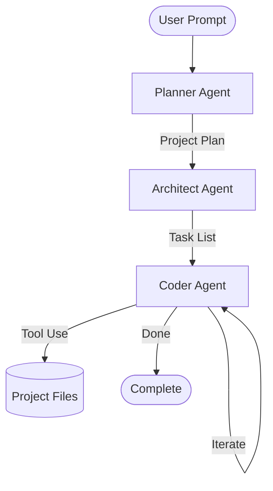

# AI Coder

AI Coder is an autonomous software engineering agent built with [LangGraph](https://github.com/langchain-ai/langgraph) and [Groq](https://groq.com/). It transforms high-level user prompts into fully functional code projects by orchestrating multiple specialized agents.

## 🏗 Architecture

The system follows a multi-agent workflow:



### Agents
1.  **Planner Agent**: Analyzes the user's request and creates a high-level engineering project plan, defining the tech stack, features, and file structure.
2.  **Architect Agent**: Breaks down the project plan into specific, file-by-file implementation tasks. It ensures that dependencies are ordered correctly (e.g., CSS before HTML).
3.  **Coder Agent**: A ReAct-style agent that executes the implementation tasks. It has access to file system tools to read, write, and list files, building the project step-by-step.

## 🛠 Tech Stack
- **Framework**: [LangGraph](https://github.com/langchain-ai/langgraph)
- **LLM**: Llama 3.3 70b (via [Groq](https://groq.com/))
- **Language**: Python 3.11+
- **Orchestration**: [LangChain](https://github.com/langchain-ai/langchain)

## 🚀 Getting Started

### Prerequisites
- Python 3.11 or higher
- A Groq API Key

### Installation

1.  Clone the repository.
2.  Install the dependencies:
    ```bash
    pip install -r requirements.txt
    # OR if using project.toml
    pip install .
    ```
3.  Create a `.env` file in the root directory and add your Groq API key:
    ```env
    GROQ_API_KEY=your_api_key_here
    ```

### Usage

Currently, the agent is configured to build a todo app by default. You can run the workflow using:

```bash
python agent/graph.py
```

The generated files will be placed in the `generated_project/` directory.

## 📁 Project Structure

- `agent/`
  - `graph.py`: LangGraph workflow definition and agent logic.
  - `prompts.py`: System prompts for Planner, Architect, and Coder.
  - `states.py`: Pydantic models for agent states and structured output.
  - `tools.py`: File system tools for the Coder agent.
- `project.toml`: Project configuration and dependencies.
